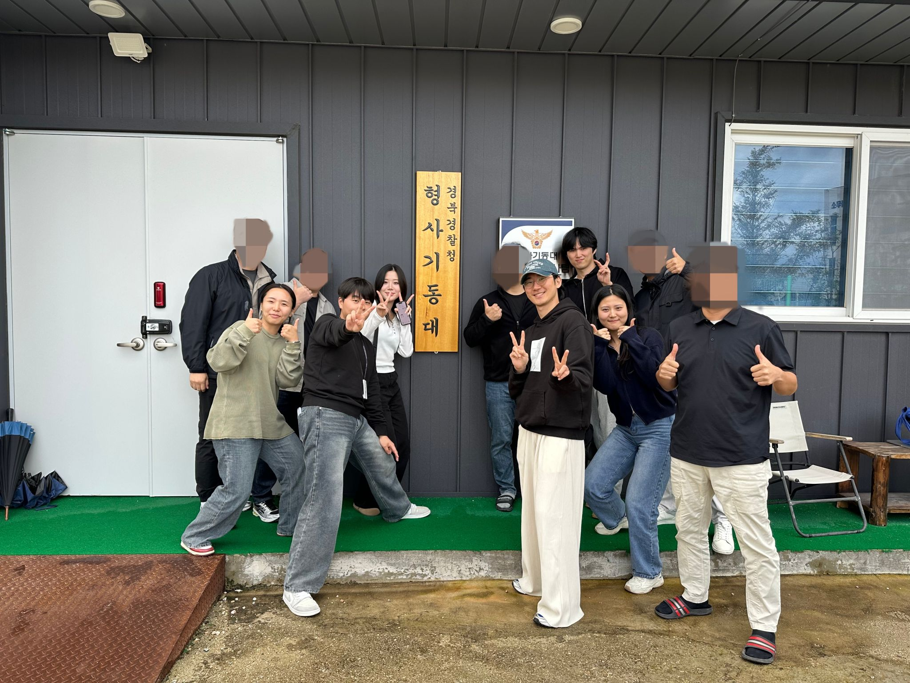

# 수사24

경찰의 추적수사 효율을 높이는 지리적 프로파일링 앱  
**팀 DreamWorms(왕꿈틀이)** · iOS Developer 4 · Designer 1 · PM 1 (2025.09 ~ 2026.03)  
🏆 Apple Developer Academy 2025 **Showcase Spotlight Team 선정** · 🤝 경북지방경찰청 협업  
[📰 개발팀 외부언론 소개](https://www.notion.so/demn/24-310ca74acc7b8155964fe2f077483ec8) · [✍️ 팀 테크 블로그 (Medium)](https://medium.com/%EC%99%95%EA%BF%88%ED%8B%80%EC%9D%B4-dreamworms)

<br />

## 💭 소개

> 형사들의 신속하고 정확한 추적수사를 위해 피의자 통신 기록과 활동 패턴을 실시간 분석하고 수사 전략을 제안하는 **'지리적 프로파일링'** 앱



<br>

[](https://swift.org)
[](https://developer.apple.com/ios/)
[](https://developer.apple.com/xcode/)

<br>

## 💡 기능

### 0. 사건 분류
> 배정받은 사건을 사건번호 기준으로 등록하고, 피의자 통신추적 기록을 사건별로 자동 구분·관리합니다.


----

### 1. 메시지에서 위치 데이터 자동 추출
> **App Intent**로 피의자의 통신 기록 메시지를 선택하면, 백그라운드에서 피의자 위치 데이터를 **자동으로 파싱**하여 사건에 즉시 등록합니다.


----

### 2. 피의자의 현재위치 확인 & 생활 패턴 분석
> 수사24 **`지도 탭`**에서 피의자의 행적과 현재 위치를 확인해 돌발 행동은 없는지 살핍니다.


----

### 3. 피의자의 수상한 행동 패턴 파악
> 누적 빈도를 통해 피의자가 피해자의 생활 반경에 자주 접근하는 등 특이 위험 패턴을 파악합니다.


----

### 4. 추가 증거 활용
> 피의자 지인으로부터 `제보받은 증거`를 스캔해서 등록하고, 지도에서 `장소 별 연관성을 파악`하고 스토킹 정황을 포착합니다.


----

### 5. CCTV 수사
> `추적 탭`에서 피해자 생활반경 내의 `CCTV 리스트`를 확인하고 탐문지역을 명확히 좁힙니다.


----

### 6. 주요 거점 분석
> `애플의 AI모델(파운데이션 모델)`이 한 줄로 요약해주는 `피의자 주요 거점` 분석 결과를 통해 잠복해야할 곳의 `장소와 시간`을 신속 정확하게 확인해서 `검거 전략`을 세울 수 있습니다.


---

## 🧑‍💻 문제 해결 과정

<details>
<summary><b>▶ Timeline 대량 데이터 렌더링 성능 최적화</b></summary>

[PR #245](https://github.com/DeveloperAcademy-POSTECH/2025-C6-M6-DreamWorms/pull/245)

### 문제 배경

> LazyVStack에서 VStack으로 전환해 scrollTo 앵커 문제는 해결했지만, 5,000건 규모의 테스트 데이터를 VStack이 한 번에 렌더링하면서 새로운 성능 문제가 발생했습니다.

### Before — Instruments 분석

> 5,000건 데이터 로드 시 측정 결과

<!-- 📸 필요한 이미지: Instruments Allocations 스크린샷 (All Heap 653MB) -->
<!-- 📸 필요한 이미지: Instruments Hangs 스크린샷 (14회, 평균 3.88s) -->
<!-- 📸 필요한 이미지: Instruments Thermal State 스크린샷 (Nominal → Fair) -->

- All Heap 메모리 **653MB**까지 상승하여 해소되지 않음
- Hang **14회**, 평균 **3.88초**, 최대 **10.74초**
- Thermal State가 Nominal → **Fair**까지 상승
- 커스텀 날짜 양식을 위해 computed property에서 DateFormatter를 **셀마다 새로 생성** → 수천 개 인스턴스 반복 생성

### 해결

**1. 하이브리드 렌더링** — 날짜별 그룹 상위 VStack은 전체 렌더링(scrollTo 앵커 보장), 각 날짜 그룹 내부 셀만 LazyVStack으로 전환

```swift
// [Before] VStack 전체 렌더링
VStack(spacing: 0) {
    ForEach(groupedLocations) { group in
        VStack(spacing: 0) {
            Color.clear.id(group.dateID)
            TimeLineDateSectionHeader(...)
            VStack(spacing: 0) {                  // ← 전체 렌더링
                ForEach(group.consecutiveGroups) { ... }
            }
        }
    }
}

// [After] 하이브리드 — 헤더 VStack + 셀 LazyVStack
VStack(spacing: 0) {
    ForEach(groupedLocations) { group in
        VStack(spacing: 0) {
            Color.clear.id(group.dateID)           // Anchor — 즉시 생성
            TimeLineDateSectionHeader(...)
            LazyVStack(spacing: 0) {               // ← 화면 근처만 렌더링
                ForEach(group.consecutiveGroups) { ... }
            }
        }
    }
}
```

**2. DateFormatter static 캐싱** — computed property에서 매번 생성하던 DateFormatter를 `static let`으로 3개만 생성하여 재사용

```swift
// [Before] 셀마다 새 인스턴스 생성
var formattedDate: String {
    let formatter = DateFormatter()       // 5,000번 생성
    formatter.dateFormat = "MM.dd (E)"
    return formatter.string(from: date)
}

// [After] static let — 앱 전체에서 3개만 생성
extension Date {
    private static let chipFormatter: DateFormatter = {
        let f = DateFormatter()
        f.dateFormat = "M.d"
        return f
    }()
    private static let headerFormatter: DateFormatter = {
        let f = DateFormatter()
        f.dateFormat = "M월 d일 (E)"
        return f
    }()
    private static let timeFormatter: DateFormatter = {
        let f = DateFormatter()
        f.dateFormat = "a h:mm"
        return f
    }()
}
```

### After — Instruments 재측정

<!-- 📸 필요한 이미지: 개선 후 Instruments Allocations 스크린샷 (143MB) -->
<!-- 📸 필요한 이미지: 개선 후 Instruments Hangs 스크린샷 (평균 729ms) -->

### 결과

| 항목 | Before | After | 변화 |
|:---:|:---:|:---:|:---:|
| All Heap 메모리 | 653 MB | 143 MB | **4.6배 감소** |
| CPU 사용률 | ~100% 지속 | 간헐적 스파이크 | **대폭 개선** |
| Thermal State | Nominal → Fair | Nominal 유지 | **개선** |
| Hang | 14회, 평균 3.88s | 21회, 평균 729ms | **5.3배 개선** |
| scrollTo 앵커 | 작동 | 작동 | **유지** |

### Known Limitations

- 초반 데이터 로드 Hang은 CoreData fetch 구조 (`compactMap` 전체 변환)에 기인. `fetchBatchSize` + fetch 구조 리팩토링으로 해결 가능
- 탭 전환 시 순간 튐 현상은 VStack 날짜 헤더 재렌더링으로 인한 것. 데이터 캐싱으로 추후 개선 가능

</details>

<details>
<summary><b>▶ 아키텍처 진화: MVVM → Redux 차용 (DWStore)</b></summary>

[PR #50](https://github.com/DeveloperAcademy-POSTECH/2025-C6-M6-DreamWorms/pull/50) · [PR #122](https://github.com/DeveloperAcademy-POSTECH/2025-C6-M6-DreamWorms/pull/122)

### 문제 배경

> DreamWorms-iOS MVP에서는 MVVM + Combine(`ObservableObject` + `@Published`)을 사용했습니다.

**문제점**
- ViewModel 내부에서 상태 변경이 어디서든 가능하여, 데이터 흐름 추적이 어려움
- 여러 화면(Map, Timeline, Dashboard)이 동일한 위치 데이터를 각자 관리하면서 **데이터 불일치** 발생
- Side Effect(네트워크, CoreData)가 ViewModel에 직접 섞여 테스트 어려움
- Swift 6 Strict Concurrency에서 `ObservableObject`의 Sendable 적합성 문제

<!-- 📸 필요한 이미지: MVVM 구조에서 데이터 불일치가 발생하는 다이어그램 (Before) -->

```swift
// [Before] DreamWorms-iOS - MVVM + Combine
@MainActor
final class MapViewModel: ObservableObject {
    @Published var cameraPosition: NMFCameraPosition?
    @Published var locations: [NaverMapLocationData] = []
    @Published var displayMode: NaverMapDisplayMode = .uniqueLocations

    private var modelContext: ModelContext?

    func loadMockLocations() {
        let mockLocations = MockLocationLoader.loadFromJSON()
        locations = mockLocations.map { ... }
        moveCameraToLatestMarker()
    }
}
```

### 해결: TCA 영감의 Custom Redux Architecture

TCA의 학습 곡선과 일정을 고려해 **Redux/MVI에서 핵심 4요소만 추출**한 경량 프레임워크를 설계. 팀원 4명이 **1주일 내 숙달**.

- **단방향 데이터 흐름**: Action → Reducer → State → View 순환으로 상태 변경 추적 용이
- **SSOT(Single Source of Truth)**: MainTabFeature가 위치 데이터를 유일하게 소유, Timeline/Map은 소비만
- **Side Effect 분리**: `DWEffect`로 비동기 로직을 Reducer 외부로 격리
- **Swift 6 완전 호환**: 모든 프로토콜이 `Sendable`, Store가 `@MainActor`로 격리

<!-- 📸 필요한 이미지: DWStore 단방향 데이터 흐름 다이어그램 (Action → Reducer → State → View) -->

```swift
// [After] SUSA24-iOS - Custom Redux (DWStore)

// 1. 프로토콜 정의 - 모든 타입이 Sendable
public protocol DWState: Sendable {}
public protocol DWAction: Sendable {}

@MainActor
public protocol DWReducer: Sendable {
    associatedtype State: DWState
    associatedtype Action: DWAction
    func reduce(into state: inout State, action: Action) -> DWEffect<Action>
}

// 2. Store - @Observable + @MainActor로 Swift 6 안전
@MainActor @Observable
public final class DWStore<R: DWReducer> {
    public private(set) var state: R.State  // 외부에서 직접 변경 불가
    private let reducer: R

    public func send(_ action: R.Action) {
        let effect = reducer.reduce(into: &state, action: action)
        Task { [weak self] in
            await effect.run { [weak self] next in
                Task { @MainActor [weak self] in self?.send(next) }
            }
        }
    }
}

// 3. Effect - 비동기 부수효과 모델링
public struct DWEffect<Action: DWAction>: Sendable {
    public let run: @Sendable (@escaping @Sendable (Action) -> Void) async -> Void

    public static var none: Self { .init { _ in } }

    public static func task(_ work: @escaping @Sendable () async -> Action?) -> Self {
        .init { downstream in
            if let a = await work() { downstream(a) }
        }
    }

    public static func merge(_ effects: DWEffect<Action>...) -> DWEffect<Action> {
        .init { downstream in
            await withTaskGroup(of: Void.self) { group in
                for effect in effects {
                    group.addTask { await effect.run(downstream) }
                }
            }
        }
    }
}
```

### Feature 패턴 예시

```swift
struct TimeLineFeature: DWReducer {
    struct State: DWState {
        var locations: [Location]
        var groupedLocations: [LocationGroupedByDate]
        var searchText: String = ""
        var isSearchActive: Bool = false
    }

    enum Action: DWAction {
        case onAppear
        case updateData(caseInfo: Case?, locations: [Location])
        case searchTextChanged(String)
        case locationTapped(Location)
        case scrollToDate(Date)
    }

    func reduce(into state: inout State, action: Action) -> DWEffect<Action> {
        switch action {
        case .updateData(let caseInfo, let locations):
            state.locations = locations
            state.groupedLocations = groupLocations(locations)
            return .none

        case .searchTextChanged(let text):
            state.searchText = text
            let taskID = UUID()
            state.searchDebounceTaskID = taskID
            return .task {
                try? await Task.sleep(for: .milliseconds(250))
                return .performSearch(text, taskID: taskID)
            }
        // ...
        }
    }
}
```

</details>

<details>
<summary><b>▶ App Intent 기반 위치 데이터 자동 수집</b></summary>

[PR #91](https://github.com/DeveloperAcademy-POSTECH/2025-C6-M6-DreamWorms/pull/91) · [PR #122](https://github.com/DeveloperAcademy-POSTECH/2025-C6-M6-DreamWorms/pull/122) · [PR #203](https://github.com/DeveloperAcademy-POSTECH/2025-C6-M6-DreamWorms/pull/203) · [PR #216](https://github.com/DeveloperAcademy-POSTECH/2025-C6-M6-DreamWorms/pull/216)

### 도입 목적

- 수동 입력 제거: "문자 확인 → 타 지도앱 수동 입력 → 위치 확인 → 팀 공유" 단계를 자동화
- 사건별 데이터 축적: 위치 정보를 사건 단위로 자동 분류/저장
- 실시간 가시화: 수집 즉시 지도 핀 + 타임라인 셀로 표시

### 파이프라인 흐름 (7단계)

<!-- 📸 필요한 이미지: 7단계 파이프라인 흐름도 (SMS → CoreData → UI 반영) -->

```
SMS 수신 → iOS 단축어 트리거 → ReceiveMessageIntent.perform()
  → 전화번호 정규화 (+82→0, 하이픈 제거)
  → CaseRepository.findCaseTest(byCasePhoneNumber:) 사건 매칭
  → MessageParser.extractAddress(from:) 주소 추출
  → NaverGeocodeAPIService.geocode(address:) 좌표 변환
  → LocationRepository.createLocationFromMessage() CoreData 저장
  → MainTabFeature SSOT Observer → Timeline/Map 실시간 반영
```

### iOS Shortcuts Privacy 제한 우회: 3단계 접근 전환

**1차 설계 — 전화번호 매칭**

초기에는 SMS 발신자 전화번호로 사건을 자동 매칭하는 구조로 설계했습니다.

**장벽: Apple Privacy 정책**

iOS Shortcuts 개인정보 정책상 **발신자 전화번호 접근이 차단**되었습니다. 자동 수집의 핵심 전제가 원천적으로 막힌 상황이었습니다.

**2차 전환 — 사건번호 매칭**

Apple 정책 문서를 분석한 결과 **메시지 본문은 접근 가능**함을 확인. 매칭 키를 전화번호에서 사건번호로 전환.

```swift
@Parameter(title: "사건번호") var caseNumber: String

guard let caseID = try await caseRepo.findCase(byCaseNumber: caseNumber) else {
    return .result(dialog: "해당 사건번호를 찾을 수 없습니다")
}
```

**3차 전환 — 전화번호 앱 내 사전 등록**

수사관으로부터 "사건번호를 매번 입력하기 어렵다"는 피드백. 전화번호를 앱 내부에 사전 등록하고, Shortcuts에서는 SMS 본문만 전달받는 구조로 재전환.

```swift
let normalized = senderPhoneNumber
    .replacingOccurrences(of: "-", with: "")
    .replacingOccurrences(of: " ", with: "")
    .replacingOccurrences(of: "+82", with: "0")

guard let caseID = try await caseRepo.findCaseTest(byCasePhoneNumber: normalized) else {
    return .result(dialog: "해당 전화번호의 사건을 찾을 수 없습니다")
}
```

→ 수사관 입력 단계 **4단계 → 0단계**, Shortcut 1회 설정 후 완전 자동화, Apple Privacy 정책 준수 유지

### 핵심 구현: ReceiveMessageIntent

```swift
struct ReceiveMessageIntent: AppIntent {
    static var title: LocalizedStringResource = "기지국 위치정보 저장하기"

    @Parameter(title: "메시지 내용") var messageBody: String
    @Parameter(title: "발신자 번호") var senderPhoneNumber: String

    func perform() async throws -> some IntentResult & ProvidesDialog {
        let normalized = senderPhoneNumber
            .replacingOccurrences(of: "-", with: "")
            .replacingOccurrences(of: "+82", with: "0")

        let context = PersistenceController.shared.container.viewContext
        let caseRepo = CaseRepository(context: context)
        guard let caseID = try await caseRepo.findCaseTest(byCasePhoneNumber: normalized) else {
            return .result(dialog: "해당 전화번호의 사건을 찾을 수 없습니다")
        }

        guard let address = MessageParser.extractAddress(from: messageBody) else {
            return .result(dialog: "주소를 추출할 수 없습니다")
        }

        let geocodeResult = try await NaverGeocodeAPIService.shared.geocode(address: address)

        let locationRepo = LocationRepository(context: context)
        try await locationRepo.createLocationFromMessage(
            caseID: caseID, address: address,
            latitude: geocodeResult.latitude, longitude: geocodeResult.longitude
        )
        return .result(dialog: "위치가 저장되었습니다: \(address)")
    }
}
```

### MessageParser — SMS 텍스트 파싱

```swift
enum MessageParser {
    static func containsInvalidKeywords(from text: String) -> Bool {
        let invalidKeywords = ["확인불가", "전원꺼짐", "전원 상태 N"]
        return invalidKeywords.contains { text.contains($0) }
    }

    static func extractAddress(from text: String) -> String? {
        guard !containsInvalidKeywords(from: text) else { return nil }

        guard let address = findAddress(from: text, pattern: "발신기지국") else {
            return nil
        }

        if let number = extractFirstNumber(from: text) {
            return "\(address) \(number)"
        }
        return address
    }
}
```

### SSOT Observer — AsyncStream 실시간 동기화

App Intent로 저장된 데이터가 자동으로 UI에 반영되는 핵심 메커니즘. `MainTabFeature`가 **유일한 데이터 소유자(SSOT)**로서 `AsyncStream`을 구독하고, 하위 Feature에 단방향으로 전파합니다.

<!-- 📸 필요한 이미지: SSOT 데이터 흐름도 (MainTabFeature → Timeline/Map 단방향 전파) -->

```swift
// LocationRepository - CoreData 변경 감지 AsyncStream
func watchLocations(caseId: UUID) -> AsyncStream<[Location]> {
    AsyncStream { continuation in
        Task {
            if let initial = try? await fetchLocations(caseId: caseId) {
                continuation.yield(initial)
            }
            for await _ in NotificationCenter.default.notifications(
                named: .NSManagedObjectContextObjectsDidChange, object: context
            ) {
                if let locations = try? await fetchLocations(caseId: caseId) {
                    continuation.yield(locations)
                }
            }
        }
    }
}

// MainTabFeature - SSOT 소유자
case .startLocationObserver:
    return DWEffect { [locationRepository] downstream in
        let stream = await MainActor.run {
            locationRepository.watchLocations(caseId: caseId)
        }
        for await locations in stream {
            downstream(.locationsUpdated(locations))
        }
    }

// MainTabView - 하위 Feature에 데이터 전파
.onChange(of: store.state.locations) { _, locations in
    timelineStore.send(.updateData(caseInfo: store.state.caseInfo, locations: locations))
}
```

</details>

<details>
<summary><b>▶ LazyVStack → VStack + Anchor 전환</b></summary>

[PR #14](https://github.com/DeveloperAcademy-POSTECH/2025-C6-M6-DreamWorms/pull/14) · [PR #41](https://github.com/DeveloperAcademy-POSTECH/2025-C6-M6-DreamWorms/pull/41) · [PR #130](https://github.com/DeveloperAcademy-POSTECH/2025-C6-M6-DreamWorms/pull/130)

### 문제 배경

> 타임라인 바텀시트에서 날짜 칩을 탭하면 해당 날짜 섹션으로 스크롤하는 기능이 필요했습니다.

`LazyVStack`은 화면에 보이는 뷰만 렌더링하므로 바텀시트 그래버가 정상 작동하고 스크롤은 부드러움. 하지만 **화면 밖의 Anchor `.id()`가 아직 생성되지 않아** `scrollTo()`가 실패. 288개 이상의 위치 데이터에서 날짜 칩 탭→스크롤이 동작하지 않음.

### 해결: VStack + ScrollViewReader

```swift
// [Before] LazyVStack — 화면 밖 Anchor 미생성으로 scrollTo 실패
ScrollViewReader { proxy in
    ScrollView {
        LazyVStack(spacing: 0) {
            ForEach(groupedLocations) { group in
                Color.clear.frame(height: 0).id(group.dateID)  // Anchor
                // ... content
            }
        }
        .onChange(of: scrollTargetID) { _, targetID in
            proxy.scrollTo(targetID, anchor: .top)  // 동작 안함!
        }
    }
}

// [After] VStack — 모든 Anchor가 즉시 생성됨
ScrollViewReader { proxy in
    ScrollView {
        VStack(spacing: 0) {
            ForEach(groupedLocations) { group in
                VStack(spacing: 0) {
                    Color.clear.frame(height: 0).id(group.dateID)  // 즉시 생성
                    // ... content
                }
            }
        }
        .onChange(of: scrollTargetID) { _, targetID in
            guard let targetID else { return }
            withAnimation(.snappy(duration: 0.3)) {
                proxy.scrollTo(targetID, anchor: .top)  // 정상 동작
            }
        }
    }
}
```

초기 렌더링 비용이 증가하지만, 바텀시트 내부의 데이터 양(수십~수백 개)에서는 체감할 수 없는 수준. 이후 5,000건 규모에서 발생한 성능 문제는 **하이브리드 렌더링**으로 해결.

</details>

<details>
<summary><b>▶ BottomSheet 스크롤/드래그 충돌 + ScrollTarget UUID</b></summary>

[PR #130](https://github.com/DeveloperAcademy-POSTECH/2025-C6-M6-DreamWorms/pull/130)

### 문제 배경

> 바텀시트를 mid 높이로 올린 상태에서 타임라인을 터치하면, **스크롤 대신 시트 드래그가 먼저 잡히는** 문제가 발생했습니다. 또한 같은 날짜 칩을 두 번 탭하면 **scrollTo가 발동하지 않는** 문제도 있었습니다.

### 문제점

1. **제스처 충돌**: PresentationDetent 시트의 드래그 제스처가 내부 ScrollView 스크롤보다 우선 처리됨
2. **동일 값 무시**: SwiftUI의 `.onChange(of:)`는 같은 값이 다시 설정되면 트리거되지 않음 → 같은 날짜 재탭 시 스크롤 안 됨

### 해결

```swift
// 1. 스크롤 우선 처리
.presentationContentInteraction(.scrolls)  // 시트 내부에서는 스크롤이 드래그보다 우선

// 2. ScrollTarget에 UUID 포함 → 동일 날짜 재탭에도 새 값으로 인식
struct ScrollTarget: Equatable {
    let dateID: String
    let triggerID: UUID  // 매 탭마다 새 UUID 생성

    static func == (lhs: Self, rhs: Self) -> Bool {
        lhs.triggerID == rhs.triggerID  // 같은 dateID여도 항상 "변경됨"으로 감지
    }
}

// 날짜 칩 탭 시
func scrollToDate(_ date: Date) {
    scrollTarget = ScrollTarget(
        dateID: date.dateID,
        triggerID: UUID()  // 매번 새 UUID → onChange 항상 트리거
    )
}
```

### 결과

- 시트 mid 높이에서 타임라인 스크롤이 자연스럽게 동작
- 동일 날짜 칩 재탭 시에도 정상 이동

</details>

<details>
<summary><b>▶ Timeline 실시간 검색 — Combine 없이 UUID 디바운스</b></summary>

[PR #214](https://github.com/DeveloperAcademy-POSTECH/2025-C6-M6-DreamWorms/pull/214) · [PR #219](https://github.com/DeveloperAcademy-POSTECH/2025-C6-M6-DreamWorms/pull/219) · [PR #223](https://github.com/DeveloperAcademy-POSTECH/2025-C6-M6-DreamWorms/pull/223)

### 문제 배경

> 타임라인에서 기지국 주소를 실시간으로 검색하는 기능이 필요했습니다. 한글 조합형 입력 시 디바운스 타이밍이 어색했고, 단방향 아키텍처(DWStore)에서 Combine을 사용하면 아키텍처 일관성이 깨지는 문제가 있었습니다.

### 문제점

- 한글 입력: "대" → "대구" → "대구시" 각 글자마다 검색 호출 → **불필요한 8회 이상 호출**
- Combine의 `.debounce()` 사용 시: `AnyCancellable` 관리 필요 + DWStore 패턴과 충돌
- 이전 검색 결과가 나중에 도착하면 **stale 결과가 최신 결과를 덮어쓰는** 위험

### 해결

```swift
case .searchTextChanged(let text):
    state.searchText = text
    let taskID = UUID()
    state.searchDebounceTaskID = taskID
    return .task {
        try? await Task.sleep(for: .milliseconds(250))
        return .performSearch(text, taskID: taskID)
    }

case .performSearch(let text, let taskID):
    guard taskID == state.searchDebounceTaskID else { return .none }
    // stale 결과 자동 무시 → 최신 검색만 실행
    state.filteredLocations = state.groupedLocations.filter { group in
        group.locations.contains { $0.address.contains(text) }
    }
    return .none
```

### 결과

- 빠른 타이핑 시 검색 호출: **8회 → 1회** (250ms 디바운스)
- stale 결과 방지: UUID 불일치 시 자동 무시
- Combine 의존 없이 DWStore **아키텍처 일관성 유지**

</details>

<details>
<summary><b>▶ MapDispatcher — 모듈 간 느슨한 결합 통신</b></summary>

Timeline 셀 탭 → Map 카메라 이동 등, Feature 간 직접 의존 없이 명령을 전달하는 Dispatcher 패턴.

```swift
@Observable
final class MapDispatcher {
    private(set) var request: RequestType?

    func send(_ request: RequestType) { self.request = request }
    func consume() { request = nil }

    enum RequestType: Equatable {
        case moveToSearchResult(coordinate: MapCoordinate, placeInfo: PlaceInfo)
        case moveToLocation(coordinate: MapCoordinate)
        case focusCellTimeline(cellKey: String, title: String?)
    }
}
```

</details>

<details>
<summary><b>▶ DocC 기반 인수인계 문서화</b></summary>

[PR #244](https://github.com/DeveloperAcademy-POSTECH/2025-C6-M6-DreamWorms/pull/244)

### 배경

> 2026년 4월 Exit 시점에서, 디자인팀과 다음 개발자를 위해 기능 문서화가 필요했습니다. Apple의 DocC를 선택하여 코드와 문서를 한 곳에서 관리할 수 있도록 했습니다.

<!-- 📸 필요한 이미지: DocC 렌더링된 문서 스크린샷 -->

### 작성 내용

| 문서 | 내용 |
|:---|:---|
| `appintent.md` (315줄) | App Intent 자동 수집 파이프라인 전체 문서화 |
| `timeline.md` | 타임라인 바텀시트 컴포넌트 및 데이터 흐름 |

- 시퀀스 다이어그램: 7단계 Intent 흐름
- 데이터 변환 다이어그램: SMS → Entity 변환 과정
- 의존성 다이어그램: 컴포넌트 의존 관계
- 상태 다이어그램: State Machine 시각화
- 화면 흐름도: SMS 수신 → 앱 내 데이터 반영

</details>

---

## 🧱 Architecture

| Layer | 구성요소 | 설명 |
|:---:|:---:|:---|
| **TCA** | DWStore, DWAction 등 | 단방향 데이터 흐름 기반 커스텀 상태 관리를 위해 Redux 패턴만 차용 |
| **Automation** | App Intents | 메시지 공유 → 위치 데이터 백그라운드 파싱 |
| **Persistence** | Core Data | 사건·용의자·위치 엔티티 영속화 |
| **Data** | Repository | 프로토콜 기반 데이터 접근 추상화 |
| **Navigation** | AppCoordinator | NavigationPath 기반 화면 전환 |

<br>

## 🛠 Tech Stack

### Core Frameworks


### Automation


### Media & Vision


### Location & Maps


### AI


### Environment


<br>

## 👥 Contributors

| <a href="https://github.com/YooGyeongMo"><br/><b>Demian Yoo</b></a> | <a href="https://github.com/MuchanKim"><br/><b>Muchan Kim</b></a> | <a href="https://github.com/mini-min"><br/><b>mini-min</b></a> | <a href="https://github.com/delightPIP"><br/><b>delightPIP</b></a> | <a href="https://github.com/Jikiim"><br/><b>Jikiim</b></a> | <a href="https://github.com/youryeony"><br/><b>youryeony</b></a> |
|:---:|:---:|:---:|:---:|:---:|:---:|
| iOS Developer | iOS Developer | iOS Developer | iOS Developer | UI/UX Designer | Product Manager |

---

<div align="center">

**Apple Developer Academy @ POSTECH · Team DreamWorms(왕꿈틀이) · 2025–2026**

</div>
